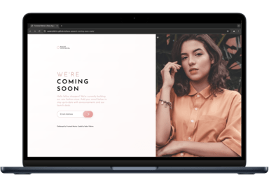

 

    
  </a>
   
   

[![Contributors][contributors-shield]][contributors-url]
[![Forks][forks-shield]][forks-url]
[![Stargazers][stars-shield]][stars-url]
[![MIT License][license-shield]][license-url]

<h3 align="center">Frontend Mentor - Base Apparel Coming Soon Page</h3>

This is a solution to the [Base Apparel Coming Soon Page Challenge on Frontend Mentor](https://www.frontendmentor.io/challenges/base-apparel-coming-soon-page-5d46b47f8db8a7063f9331a0).

  
   
    <a href="https://sedaryildirim.github.io/base-apparel-coming-soon-main/">View Site</a>
    ·
    <a href="https://github.com/sedaryildirim/base-apparel-coming-soon-main/issues">Report Bug</a>
    ·
    <a href="https://github.com/sedaryildirim/base-apparel-coming-soon-main/issues">Request Feature</a>
  

<!-- MARKDOWN LINKS & IMAGES -->
<!-- https://www.markdownguide.org/basic-syntax/#reference-style-links -->
[contributors-shield]: https://img.shields.io/github/contributors/sedaryildirim/base-apparel-coming-soon-main.svg?style=for-the-badge
[contributors-url]: https://github.com/sedaryildirim/base-apparel-coming-soon-main/graphs/contributors
[forks-shield]: https://img.shields.io/github/forks/sedaryildirim/base-apparel-coming-soon-main.svg?style=for-the-badge
[forks-url]: https://github.com/sedaryildirim/base-apparel-coming-soon-main/network/members
[stars-shield]: https://img.shields.io/github/stars/sedaryildirim/base-apparel-coming-soon-main.svg?style=for-the-badge
[stars-url]: https://github.com/sedaryildirim/base-apparel-coming-soon-main/stargazers
[license-shield]: https://img.shields.io/github/license/sedaryildirim/base-apparel-coming-soon-main.svg?style=for-the-badge
[license-url]: https://github.com/sedaryildirim/base-apparel-coming-soon-main/blob/main/LICENSE.txt
[product-screenshot]: imgs/screenshot.png